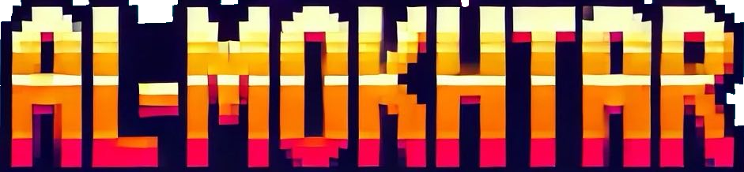
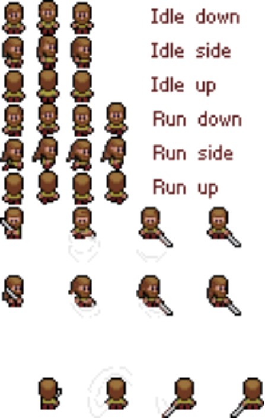

# Al_Mokhtar 🎮

<div align="center">
  
  
  **A pixel-style adventure game built with Pygame**
  
  
  
  
  
</div>

## 📖 About

Al_Mokhtar is an engaging pixel-style adventure game developed using Pygame, a powerful Python library for game development. Immerse yourself in a retro gaming experience featuring beautiful pixel art, smooth animations, and interactive gameplay mechanics. 

The game combines nostalgic visual aesthetics with modern game design principles, offering players an entertaining journey through carefully crafted levels with responsive controls and optimized performance.

## ✨ Features

- 🎨 **Retro Pixel Art**: Beautiful hand-crafted pixel graphics
- 🎮 **Smooth Gameplay**: Responsive controls and fluid animations
- 🏃‍♂️ **Multiple Characters**: Play as different characters with unique abilities
- 🌍 **Immersive Levels**: Explore diverse environments and challenges
- ⚡ **Optimized Performance**: Efficient code ensuring smooth gameplay
- 🎵 **Audio Experience**: Engaging sound effects and background music

## 🎭 Characters

Meet the heroes of Al_Mokhtar:

<div align="center">
  <table>
    <tr>
      <td align="center">
        <br>
        <b>Mokhtar</b><br>
        <i>The main protagonist</i>
      </td>
      <td align="center">
        <br>
        <b>Amira</b><br>
        <i>Mokhtar's sister</i>
      </td>
      <td align="center">
        <br>
        <b>Knight</b><br>
        <i>The evil knight</i>
      </td>
    </tr>
  </table>
</div>

## 📸 Screenshots

### Main Menu


### Gameplay Gallery
<div align="center">
  <table>
    <tr>
      <td></td>
      <td></td>
      <td></td>
    </tr>
    <tr>
      <td></td>
      <td></td>
      <td></td>
    </tr>
    <tr>
      <td></td>
      <td></td>
      <td></td>
    </tr>
    <tr>
      <td colspan="3" align="center"></td>
    </tr>
  </table>
</div>

## 🚀 Installation & Setup

### Prerequisites
- Python 3.7 or higher
- pip (Python package manager)

### Quick Start

1. **Clone the repository**
   ```bash
   git clone https://github.com/ahmdchr/ISS_Al_Mokhtar.git
   ```

2. **Navigate to the project directory**
   ```bash
   cd ISS_Al_Mokhtar
   ```

3. **Install dependencies**
   ```bash
   pip install pygame
   ```
   
   *Alternatively, if you have a requirements file:*
   ```bash
   pip install -r requirements.txt
   ```

4. **Launch the game**
   ```bash
   python ./code/main.py
   ```
   
   *On some systems, you might need to use:*
   ```bash
   python3 ./code/main.py
   ```

## 🎮 How to Play

- **Movement**: Use arrow keys or WASD to move your character
- **Actions**: Press SPACE for primary actions
- **Menu**: Press ESC to access the pause menu
- **Quit**: Press Alt+F4 or close the window to exit

*(Add specific controls and gameplay mechanics as applicable to your game)*

## 🏗️ Project Structure

```
ISS_Al_Mokhtar/
├── code/
│   ├── main.py          # Main game entry point
│   ├── game/            # Game logic modules
│   ├── assets/          # Game assets
│   └── utils/           # Utility functions
├── screenshots/         # Game screenshots
├── mokhtar.png         # Character sprite
├── amira.png           # Character sprite
├── knight.png          # Character sprite
├── logo.png            # Game logo
└── README.md           # Project documentation
```

## 🛠️ Technology Stack

- **Language**: Python 3.7+
- **Game Engine**: Pygame 2.0+
- **Graphics**: Pixel art assets
- **Audio**: Sound effects and background music

## 🤝 Contributing

Contributions are welcome! Please feel free to submit issues, feature requests, or pull requests.

1. Fork the project
2. Create your feature branch (`git checkout -b feature/AmazingFeature`)
3. Commit your changes (`git commit -m 'Add some AmazingFeature'`)
4. Push to the branch (`git push origin feature/AmazingFeature`)
5. Open a Pull Request

## 📝 License

This project is licensed under the MIT License - see the [LICENSE](LICENSE) file for details.

## 👨‍💻 Author

**Ahmed** - [@ahmdchr](https://github.com/ahmdchr)

## 🙏 Acknowledgments

- Thanks to the Pygame community for the excellent documentation and tutorials
- Inspired by classic pixel art games
- Special thanks to all contributors and testers

## 📞 Support

If you encounter any issues or have questions:

- 🐛 [Report a Bug](https://github.com/ahmdchr/ISS_Al_Mokhtar/issues)
- 💡 [Request a Feature](https://github.com/ahmdchr/ISS_Al_Mokhtar/issues)
- 📧 Contact: [Your Email] (optional)

---

<div align="center">
  <b>⭐ Star this repository if you found it helpful! ⭐</b>
</div>
