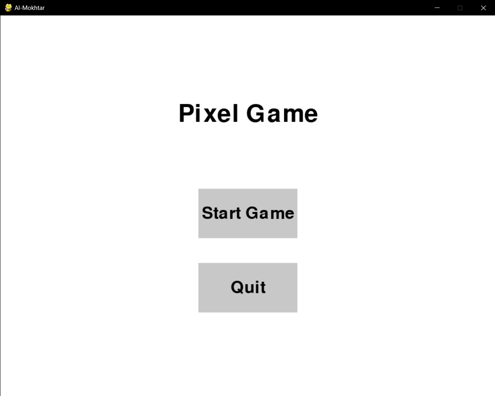
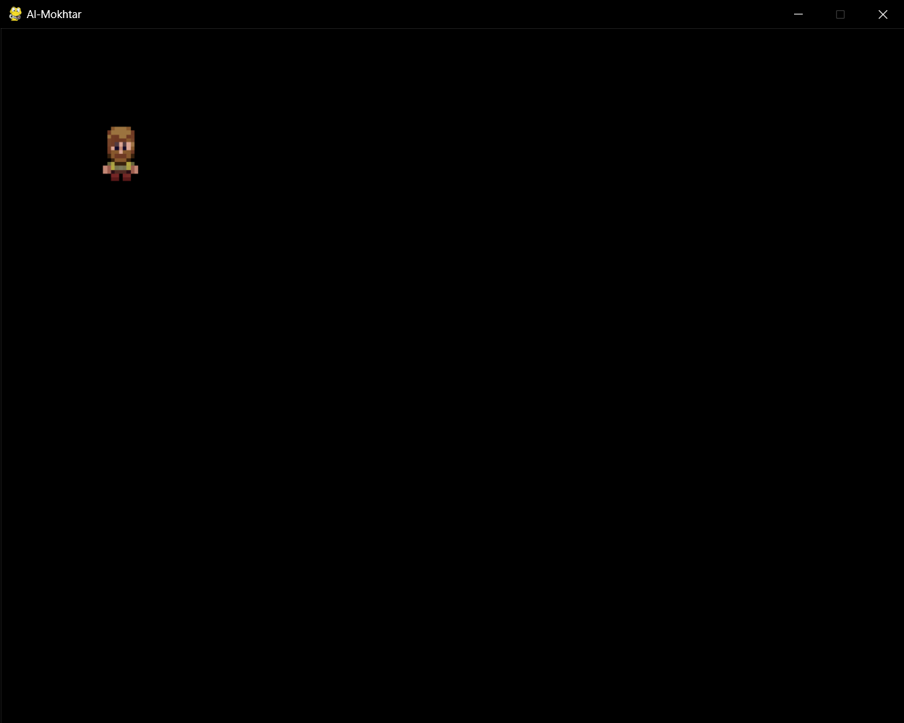
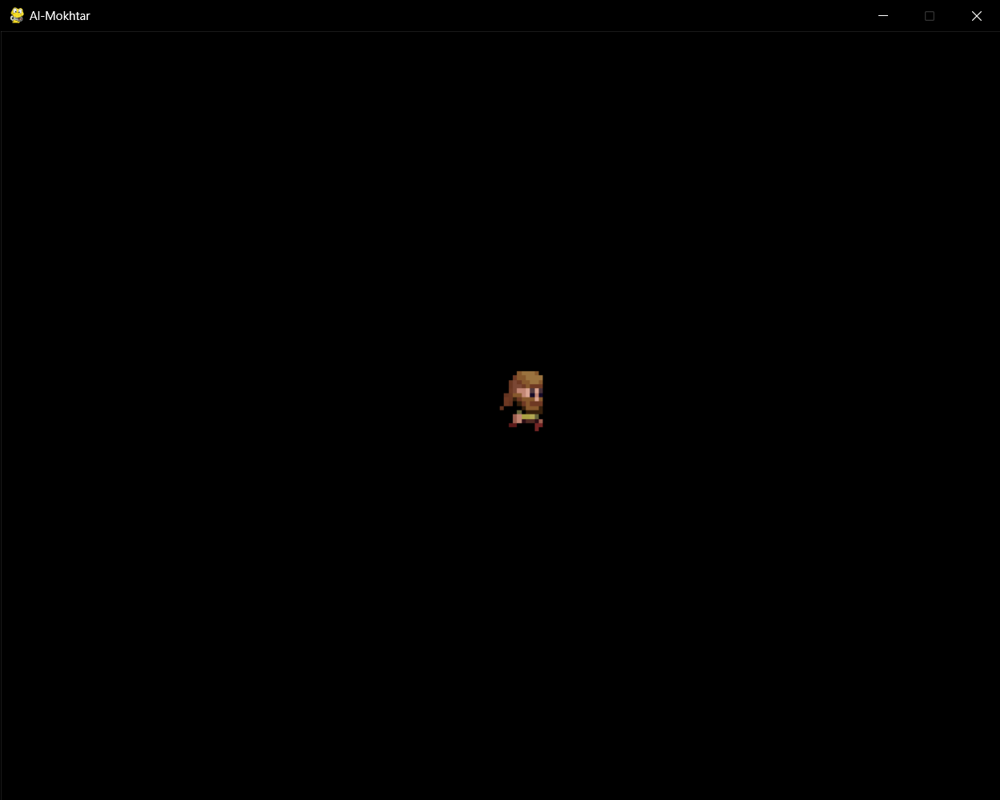

# Al_Mokhtar
This project involves developing a pixel-style game using Pygame, a Python library for game development. The game will feature retro pixel art, interactive gameplay mechanics, and smooth animations, utilizing Pygame’s functionalities for handling graphics, events, and collisions. The objective is to create an engaging and visually appealing experience while optimizing performance and ensuring responsive controls.


## Screenshots
#Main menu

#Gameplay

#Movement Animation

## Run Locally

Clone the project

```bash
  git clone https://github.com/ahmdchr/ISS_Al_Mokhtar.git
```

Go to the project directory

```bash
  cd ISS_Al_Mokhtar
```

Install dependencies

```bash
  pip install pygame
```

Start the server

```bash
  py ./code/main.py
```

